# 🔐👨‍💻 Gaspar Francisco Gulungo

**`Desenvolvedor Full Stack | Especialista em Cybersecurity | Ethical Hacker`**

Sou um desenvolvedor Full Stack com sólida atuação em cibers

Domino tecnologias modernas de desenvolvimento e aplico meus conhecimentos em segurança para construir aplicações resilientes, seguras e escaláveis. Minha abordagem une construção e quebra: desenvolvo aplicações robustas enquanto estudo e exploro falhas nelas.

    
    
    
    

---

## 🛠️ Arsenal Técnico

### 💻 **DESENVOLVIMENTO**

 
 

### 🔐 **CYBERSECURITY**

 
 

---

## 📊 GitHub Analytics

```mermaid
graph LR
    A["🎯 GASPAR<br/>CYBER EXPERT"] --> B["🛡️ SECURITY<br/>⭐⭐⭐⭐⭐"]
    A --> C["💻 FULL STACK<br/>⭐⭐⭐⭐⭐"]
    A --> D["🔍 PENTESTING<br/>⭐⭐⭐⭐⭐"]
    A --> E["🎯 RED TEAM<br/>⭐⭐⭐⭐"]
    A --> F["⚙️ DEVSECOPS<br/>⭐⭐⭐⭐"]
    
    style A fill:#000000,stroke:#00ff41,stroke-width:4px,color:#00ff41
    style B fill:#ff0040,stroke:#ffffff,stroke-width:2px,color:#ffffff
    style C fill:#0099ff,stroke:#ffffff,stroke-width:2px,color:#ffffff
    style D fill:#00ff41,stroke:#000000,stroke-width:2px,color:#000000
    style E fill:#ffa500,stroke:#ffffff,stroke-width:2px,color:#000000
    style F fill:#ff69b4,stroke:#ffffff,stroke-width:2px,color:#000000
```

| **🎯 CYBER DOMAIN** | **� EXPERTISE** | **📈 YEARS** | **🏆 ACHIEVEMENTS** |
|------------------|-------------|------------------|-------------------|
| **🔐 Penetration Testing** | ████████████████████ 95% | 3+ anos | 50+ Auditorias |
| **💻 Full Stack Development** | ████████████████████ 92% | 4+ anos | 30+ Aplicações |
| **🌐 Web Application Security** | ████████████████████ 89% | 3+ anos | OWASP Expert |
| **📡 Network Security** | ████████████████ 80% | 2+ anos | WiFi + Infrastructure |
| **🐍 Python Automation** | ████████████████████ 95% | 4+ anos | 100+ Scripts |

---

## 🧪 Laboratory Environment

  

 

```mermaid
graph TB
    A["🖥️ KALI LINUX<br/>Main Attack Platform"] --> B["🎯 HACK THE BOX<br/>Pro Labs + Machines"]
    A --> C["🔥 TRYHACKME<br/>Top 5% Ranking"]
    A --> D["🚩 CTF EVENTS<br/>Competitive Hacking"]
    A --> E["🏠 HOME LAB<br/>Custom Environment"]
    
    B --> F["📊 SKILL VALIDATION"]
    C --> F
    D --> F
    E --> F
    
    F --> G["🔐 REAL-WORLD<br/>APPLICATION"]
    
    style A fill:#ff0040,stroke:#00ff41,stroke-width:3px,color:#ffffff
    style B fill:#00ff41,stroke:#000000,stroke-width:2px,color:#000000
    style C fill:#0099ff,stroke:#ffffff,stroke-width:2px,color:#ffffff
    style D fill:#ffa500,stroke:#000000,stroke-width:2px,color:#000000
    style E fill:#ff69b4,stroke:#ffffff,stroke-width:2px,color:#000000
    style F fill:#9400d3,stroke:#00ff41,stroke-width:2px,color:#ffffff
    style G fill:#00ff41,stroke:#ff0040,stroke-width:3px,color:#000000
```

### 🏆 **CYBER ACHIEVEMENTS**

| **🎯 PLATFORM** | **📊 STATUS** | **� STATS** | **🎖️ BADGES** |
|----------------|-----------------|----------------|---------------|
| **🎯 Hack The Box** | 🔴 Hacker | 25+ Machines Owned | Pro Labs Certified |
| **🔥 TryHackMe** | 🟢 Top 5% | 80+ Rooms Completed | King of the Hill |
| **🚩 CTF Events** | 🟡 Competitor | 15+ Events | Top 10 Finishes |
| **🏠 Home Lab** | 🟣 Advanced | 10+ Vulnerable VMs | Custom Exploits |

---

## 🔥 Core Competencies

### 🏗️ **SECURE DEVELOPMENT**
- **🔒 Secure Coding** Practices
- **🔑 JWT & OAuth2** Implementation  
- **🛡️ OWASP Top 10** Prevention
- **⚡ API Security** Design
- **🔧 DevSecOps** Integration

### 💥 **OFFENSIVE SECURITY**  
- **🎯 Web Application** Pentesting
- **📡 Network** Penetration Testing
- **📱 WiFi Security** Auditing
- **🕵️ Social Engineering** (Ethical)
- **🤖 Automation** & Scripting

---

## 🤝 Connect & Collaborate

### 💼 **OPEN FOR OPPORTUNITIES:**
**🔐 Security Audits** • **💻 Secure Development** • **🎯 Red Team Operations** • **⚙️ DevSecOps Consulting**

---

> **"Building secure applications while thinking like an attacker"**

**🔐 Stay Secure, Code Safe! 💻**

